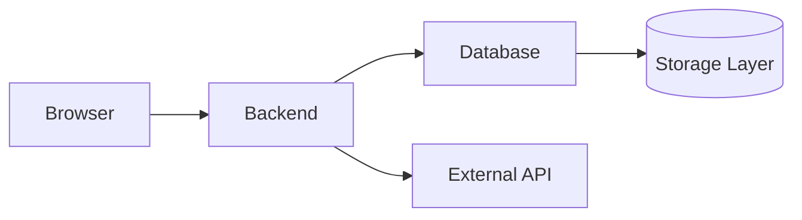
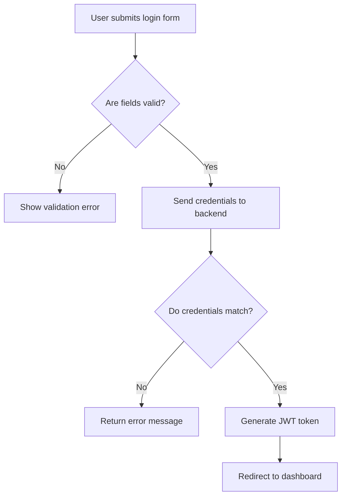
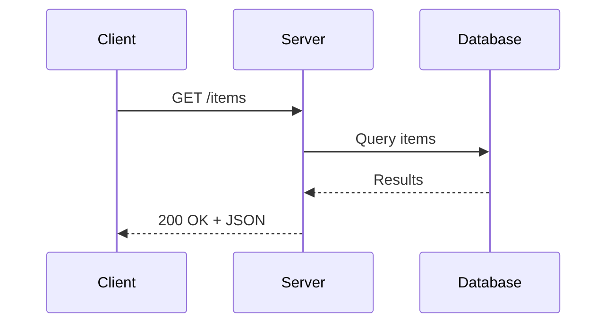

# 🔗 Table of Contents

 [🔗 Table of Contents](#-table-of-contents)
- [📁 Files](#-files)
- [🎨 Mermaid Diagrams](#-mermaid-diagrams)
    - [1️⃣ Block Diagram — Web App Architecture](#1️⃣-block-diagram--web-app-architecture)
    - [2️⃣ Flowchart — Login Flow](#2️⃣-flowchart--login-flow)
    - [3️⃣ Sequence Diagram — API Request](#3️⃣-sequence-diagram--api-request)
- [💻 Code Block Examples](#-code-block-examples)
    - [Bash Example](#bash-example)
    - [JavaScript Example](#javascript-example)

---

# 📁 Files

| File | Description |
|------|-------------|
| `drill1-login-mindmap.png` | Mindmap for a login system |
| `drill2-mermaid.md` | Three Mermaid diagrams |
| `drill3-state-machine.md` | Signup flow state machine |
| `architecture-sketch.png` | Architecture diagram (will be added in Drill 5) |
| `large-exercise.md` | Full writing exercise (later) |

---

# 🎨 Mermaid Diagrams

### 1️⃣ Block Diagram — Web App Architecture



---

### 2️⃣ Flowchart — Login Flow



---

### 3️⃣ Sequence Diagram — API Request



---

# 💻 Code Block Examples

### Bash Example

```bash
# install dependencies
npm install

# run the server
node server.js
```

### JavaScript Example

```js
app.get('/items', async (req, res) => {
  const items = await db.query('SELECT * FROM items');
  res.json(items.rows);
});
```

